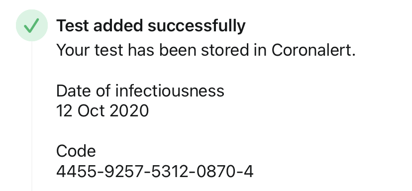

# Coronalert

[Coronalert][CA] is a privacy-preserving contact tracing app launched in Belgium. The app is based on the [DP-3T protocol][DP3T].

I wrote a simple [python script](checkcode.py) to see if a test code was generated correctly. The specs are given in the appendix "Computation of the error detection code modulo 97" in the [Coronalert technical specification][CASD]. If you split the test code in chunks of 9 digits you can carry out all computations with 32-bit integers.

Example test code:

Concatenating the date and the code yields a value `20101244559257531208704` which is 0 mod 97.

[CA]: https://coronalert.be/en/
[CASD]: https://www.esat.kuleuven.be/cosic/sites/corona-app/
[DP3T]: https://github.com/DP-3T/documents
[CPe]: http://cbcrypto.org/
